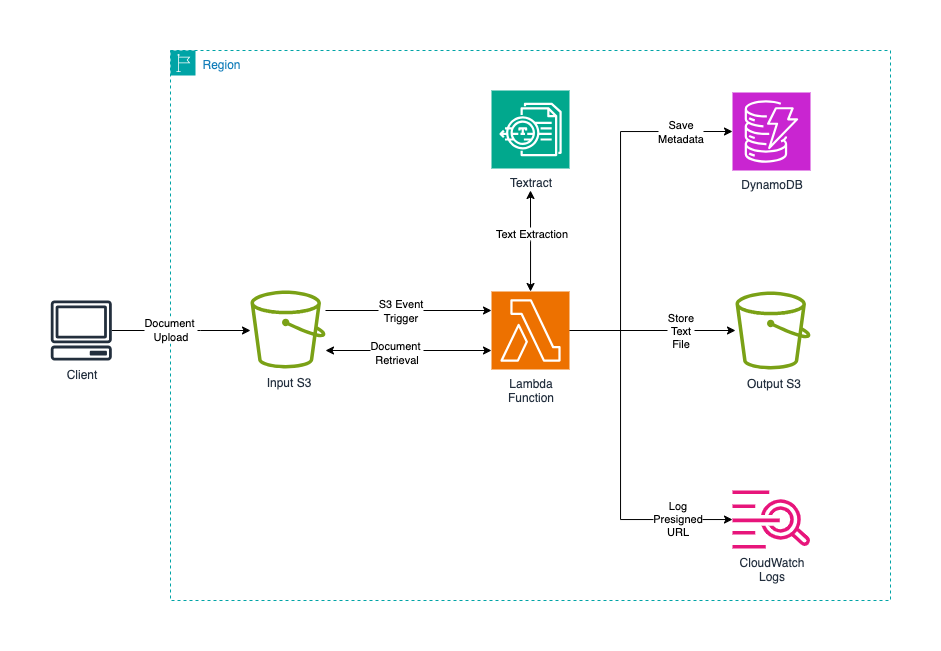

# 📄 AWS Document Processing Pipeline (Terraform)

A serverless pipeline to process documents on AWS using **Terraform Infrastructure as Code (IaC).**  
Users upload files (PDF, PNG, JPEG) → text is extracted via **Textract** → stored in S3 and DynamoDB → logs and presigned URLs go to **CloudWatch**.

---

## 🚀 Workflow
1. **Upload** → Files are uploaded to the **Input Storage Bucket**.  
2. **Trigger** → S3 event invokes the **Lambda Function**.  
3. **Process** → Lambda calls **Textract** to extract text.  
4. **Store** → Results are saved in the **Output Storage Bucket** and metadata in **DynamoDB**.  
5. **Logs** → Processing details + presigned URL logged to **CloudWatch Logs**.  

---

## 🖼 Architecture


---

## ⚙️ Tech Stack
- **AWS S3** – Input & Output Storage  
- **AWS Lambda** – Serverless document processor  
- **Amazon Textract** – Text extraction from documents  
- **Amazon DynamoDB** – Metadata storage  
- **Amazon CloudWatch Logs** – Logs & presigned URL  

---

## 📦 Deployment
```bash
cd envs/dev
terraform init
terraform apply
